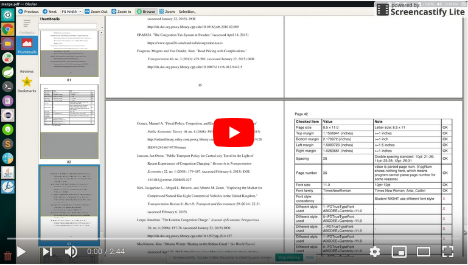
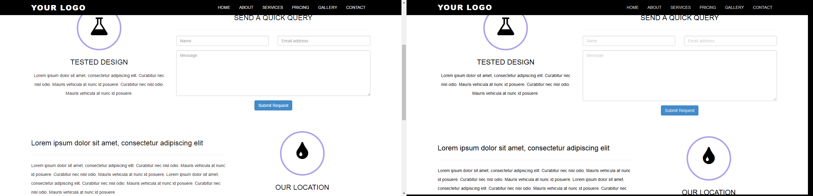

# Portfolio
* * *
## PDF format checker
This PDF format checker uses template matching to make format checker more efficient and easier for school library.
Input a PDF file and the program will generate a format report page by page showing the format errorness. 

[PDF format checker -Github](https://github.com/H-yang/FormatChecker)

## Web Browser Compatability Checker
When design front-end for a web page, you may test if your deisgn looks good in all browsers. Since you cannot force users to use a specific browser, the best you can do is to make sure your design looks great no matter the browser the user will be using.
This project helps you to test the web browser compatability. Simply specify the web page, and the program can do the followings for you:  

1. The program goes to the link you specified.
2. Program will gather the links of this page.
3. Program will visit all the links.
4. Grab two parts of html page:
    - Top area
    - Some specified location (you can edit this and make the program scroll to more locations).
5. Store images (by the html file name)
6. Run ImgCompare.py
7. View results in folder "cmp".

Results: The solid color is image from Chrome, FireFox has lighter color so that you can compare them:

Image Compare Program also combines the results so you can still compare by your eyes:

[Web Browser Compatability Checker -Github](https://github.com/H-yang/CS585FinalProject)

## Other
There are some simple tools I made just to make my life easier. They are in my github

Please check my [github](https://github.com/H-yang?tab=repositories)